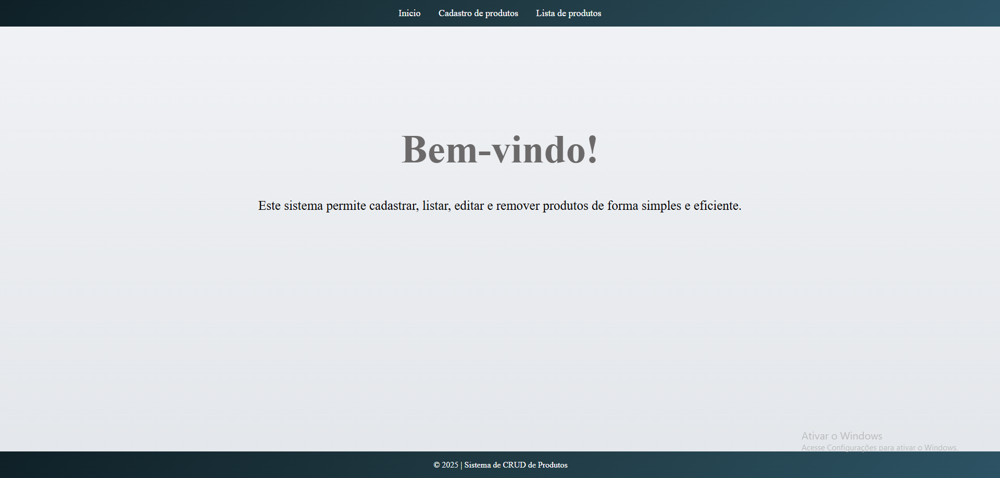
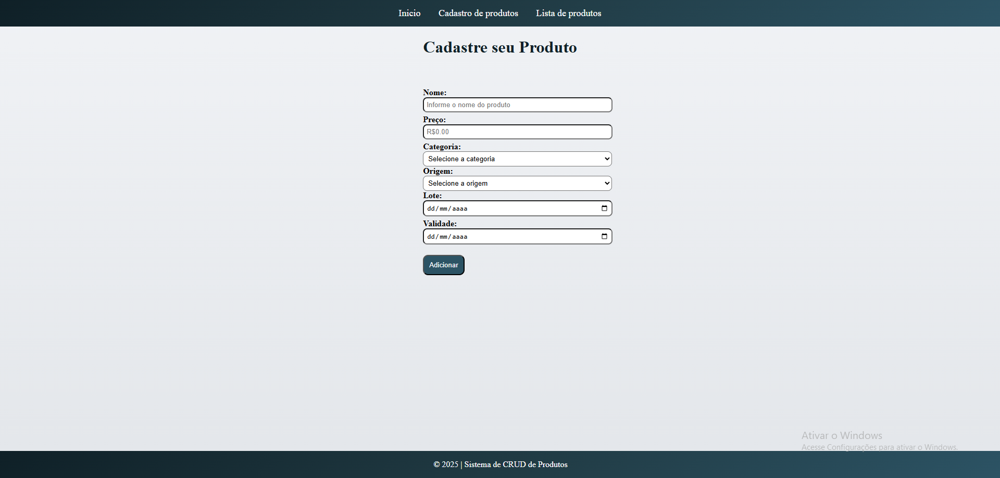
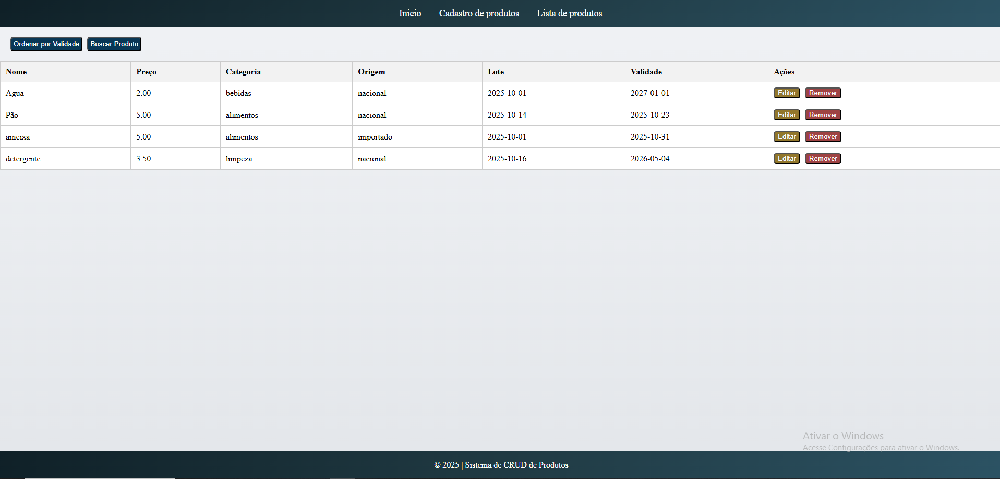

# 🛒 Sistema de CRUD de Produtos

Este é um sistema simples de **CRUD de Produtos**, feito com **HTML**, **CSS** e **JavaScript puro**. Ele permite **cadastrar**, **listar**, **editar** e **remover** produtos diretamente no navegador, utilizando o armazenamento local (`localStorage`).

---

## 🔧 Funcionalidades

- ✅ Cadastro de produtos com nome, preço, categoria, origem, lote e validade.
- 📋 Listagem dos produtos cadastrados
- 🔎 Buscar produtos por nome
- 📅 Ordenar produtos por data de validade (do mais próximo para o mais distante)
- 📝 Edição de produtos existentes
- ❌ Exclusão de produtos
- 💾 Armazenamento local com `localStorage` (sem banco de dados)

---

## 💻 Tecnologias Utilizadas

- HTML5
- CSS3
- JavaScript 
- `localStorage` para persistência de dados no navegador

---

## 📷 Capturas de Tela

### 🖼️ Tela Inicial  

### ➕ Cadastro de Produto  

### ✏️ Lista de Produtos

